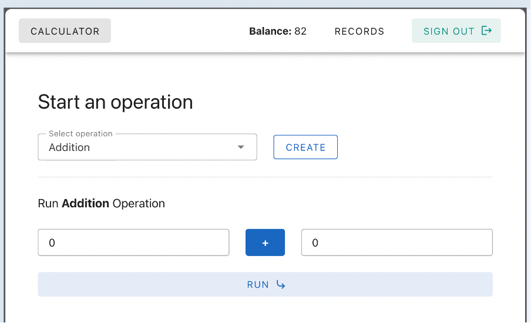
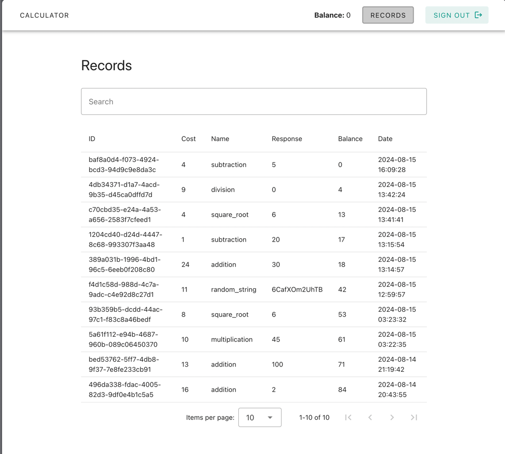

# Arithmetic Calculator

Web platform to provide a simple calculator functionality (addition, subtraction, multiplication, division, square root,
and a random string generation) where each functionality will have a separate cost per request.

User’s will have a starting credit/balance. Each request will be deducted from the user’s balance. If the user’s balance
isn’t enough to cover the request cost, the request shall be denied.

## Preview

### Operation

### Records

## How to run this project

1. Install node using nvm, run the command nvm install inside the root directory of the webapp project.
2. Run npm install to install all required dependencies.
3. Run npm run dev to start running the project in development mode.
4. The APP should be up and running at port 5173
