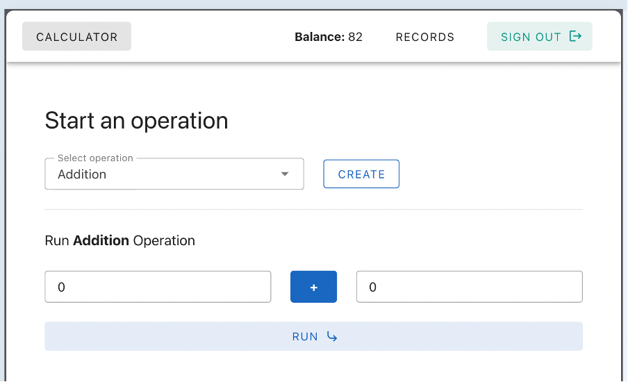

# arithmetic-calculator

## Preview

## How to run this project

1.	Install node using nvm, run the command nvm install inside the root directory of the webapp project.
2.	Run npm install to install all required dependencies.
3.	Run npm run dev to start running the project in development mode.
4.	The APP should be up and running at port 5173
